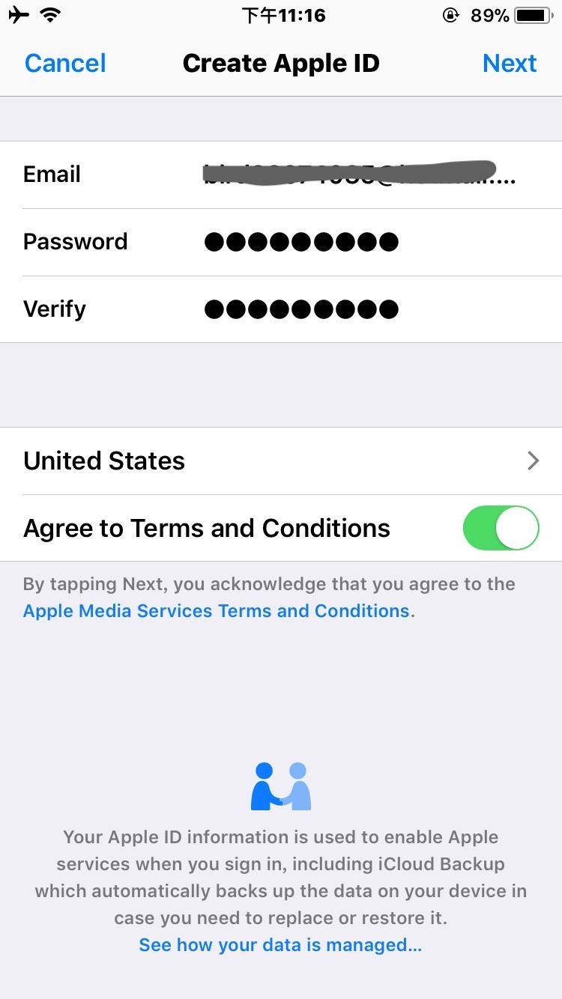

## 取得 google assistant 的方法

1. 登出你的 apple icloud

2. 打開 app store 建立你的美國帳號

3. 填寫基本資料

[step2]!(../public/img/申請美國app store_180502_0004.jpg)

4. PAYMENT 選擇 none, 地址請用 google 隨便找一個美國的地址

[step3]!(../public/img/申請美國app store_180502_0005.jpg)

5. 從信件取得 code 填入

[step4]!(../public/img/申請美國app store_180502_0002.jpg)

[step5]!(../public/img/申請美國app store_180502_0003.jpg)

6. 取得 google assistant

[step6]!(../public/img/申請美國app store_180502_0001.jpg)
